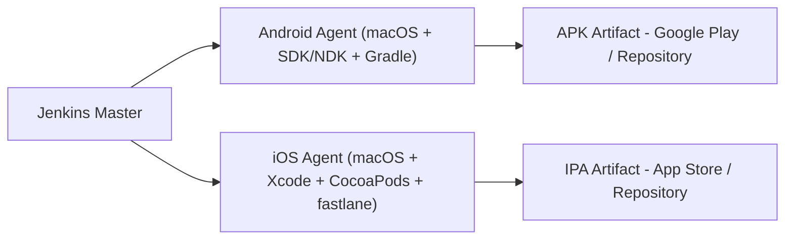

# jenkins-mobile-cicd

## Documentation

- ## Architecture
  - [CICD Platform](docs/diagram/platform.md)
  - [Requirements](docs/diagram/requirements.md)
  - [Agents](docs/diagram/agents.md)

- ## Explanation
  - [Plataform](docs/explanation/platform.md)
  - [Native Tools](docs/explanation/tools.md)

-----------

## Google Cloud Artifact Repository

- https://cloud.google.com/artifact-registry/docs
