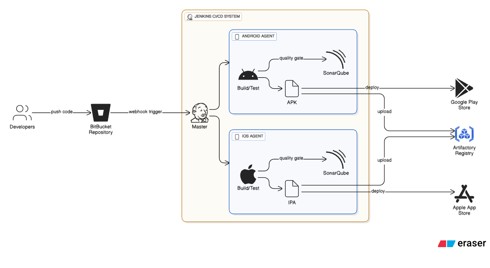

# Mobile CI/CD Pipeline with Jenkins for Android & iOS

## Overview

This project implements a CI/CD pipeline for mobile applications on iOS and Android. Its main goal is to automate building, testing, and distributing mobile apps while ensuring high QA coverage and platform-specific isolation.

## Architecture

### Components

- **Existing Jenkins Master** 
The Jenkins Master is already in place and managing the current CI/CD pipelines. No changes are required on the Master itself. The new agents will be added to this existing setup.

- **iOS Agent**
A new physical Mac machine configured with the required runtime, tools, and environment for iOS builds. This agent will be registered with the existing Jenkins Master using appropriate labels and settings.

- **Android Agent**
A new physical Mac machine configured with the required runtime, tools, and environment for Android builds. Similarly, this agent will be registered with the existing Jenkins Master with proper labels.

### Pipeline Flow

With the new agents integrated, the pipeline follows a **Git Flow branching model** and executes mobile-specific jobs:

1. Builds are triggered by commits to the iOS or Android repositories following the **Git Flow** branching model (feature → develop → release → main, plus hotfixes).  
2. Jenkins Master schedules jobs for the appropriate agent.  
3. Agents execute builds and automated tests on physical devices.  
4. Test results and build artifacts are collected and reported.  
5. Builds are optionally distributed to testers or deployment channels.

## Features

- Integration with an existing Jenkins Master.
- Build distribution and reporting through the existing CI/CD infrastructure.
- Platform-specific isolation to avoid cross-platform interference.

## Usage

### Triggering Builds

Builds are triggered automatically on commits to the mobile repositories or manually via the Jenkins interface.

### Job Execution

Each agent executes platform-specific jobs according to its configuration, including device provisioning, environment setup, and testing routines.
